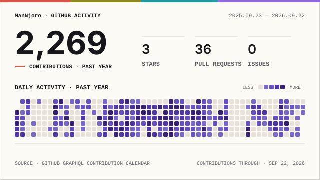

# Hi, I'm Eli John Gachago 👋

**Computer Science Graduate | Full-Stack Software Engineer | Aspiring Data Scientist**

I'm a software engineer from Kenya focused on building practical, scalable web and mobile applications. I enjoy working across the stack—from designing responsive interfaces to developing APIs, databases, authentication systems, and deployment workflows.

I have a background in **Computer Science** and software engineering training through **ALX Africa**, with hands-on experience building applications using **React, React Native, Python, Django, Node.js, and TypeScript**.

I'm also developing my skills in **data analysis, machine learning, and AI**, with an interest in using data to build smarter products and make better decisions.

### What I Work With

* **Frontend:** React, React Native, TypeScript, JavaScript, Tailwind CSS
* **Backend:** Python, Django/DRF, Node.js, Express
* **Databases:** PostgreSQL, MySQL
* **Data & AI:** Python, Pandas, NumPy, scikit-learn
* **DevOps & Tools:** Docker, Git, GitHub, Vite
* **APIs & Integrations:** REST APIs, authentication, payments, cloud services

### Featured Work

Some of the projects I've worked on include:

* **Mwewe ServiceTrack** — A service management platform for managing clients, staff, tasks, vehicles, and operational workflows.
* **OmniTix** — An event ticketing platform with online payments, reservations, QR-based tickets, and attendance tracking.
* **WinguPort** — An aviation workforce recruitment platform connecting aviation professionals, recruiters, and administrators.
* **MemeDrop** — A web and mobile platform for discovering, sharing, and managing internet memes.
* **SmartHive AI** — A project exploring data-driven customer segmentation and marketing insights for small businesses.

### Connect With Me

* **Portfolio:** [eligachago.vercel.app](https://eligachago.vercel.app)
* **LinkedIn:** [linkedin.com/in/eli-john-gachago-306a23238](https://linkedin.com/in/eli-john-gachago-306a23238)
* **GitHub:** [github.com/ManNjoro](https://github.com/ManNjoro)
* **Email:** [elijohnmwoho@gmail.com](mailto:elijohnmwoho@gmail.com)

## 📊 GitHub Activity

<picture>
  <source
    media="(prefers-color-scheme: dark)"
    srcset="./profile/signal-field-wide-dark.svg"
  />
  
</picture>

---

> Building useful software, learning continuously, and exploring the intersection of software engineering, data, and AI.
